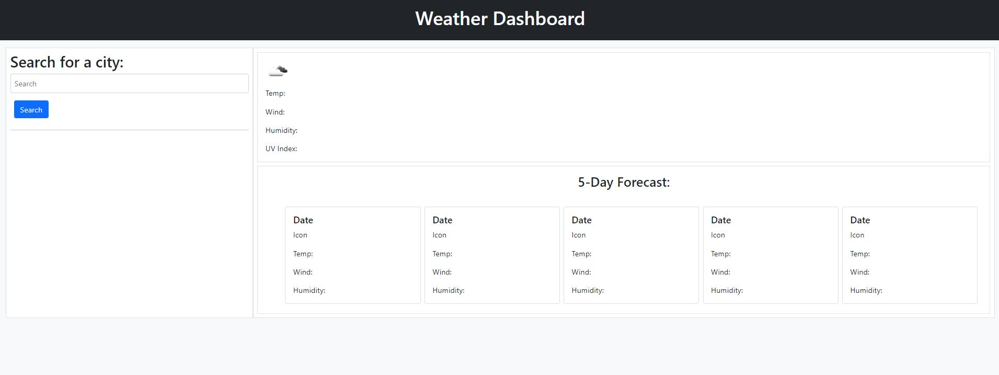
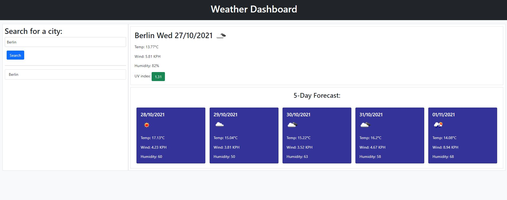

## ESMT Coding Boot Camp

## Homework-06

# Weather Dashboard

# Description

This is a simple weather dashboard using the OpenWeather One Call API. Users search for a city, and are presented with the day's weather (including an icon, temperature, humidity, wind speed and UV index), as well as a five-day forecast. Searched cities are saved in local storage, which also populates a search history below the search bar.

This app uses HTML, CSS, Bootstrap, JS, JQuery, and the OpenWeather API

# Link to deployed app

https://queenmcsteve.github.io/Homework-06/

# Link to repository

https://github.com/queenmcsteve/Homework-06

# Screenshot

Empty

With user input

Copyright 2021 Queen McSteve (queen.mcsteve.666@gmail.com)

Permission is hereby granted, free of charge, to any person obtaining a copy of this software and associated documentation files (the "Software"), to deal in the Software without restriction, including without limitation the rights to use, copy, modify, merge, publish, distribute, sublicense, and/or sell copies of the Software, and to permit persons to whom the Software is furnished to do so, subject to the following conditions:

The above copyright notice and this permission notice shall be included in all copies or substantial portions of the Software.

THE SOFTWARE IS PROVIDED "AS IS", WITHOUT WARRANTY OF ANY KIND, EXPRESS OR IMPLIED, INCLUDING BUT NOT LIMITED TO THE WARRANTIES OF MERCHANTABILITY, FITNESS FOR A PARTICULAR PURPOSE AND NONINFRINGEMENT. IN NO EVENT SHALL THE AUTHORS OR COPYRIGHT HOLDERS BE LIABLE FOR ANY CLAIM, DAMAGES OR OTHER LIABILITY, WHETHER IN AN ACTION OF CONTRACT, TORT OR OTHERWISE, ARISING FROM, OUT OF OR IN CONNECTION WITH THE SOFTWARE OR THE USE OR OTHER DEALINGS IN THE SOFTWARE.
